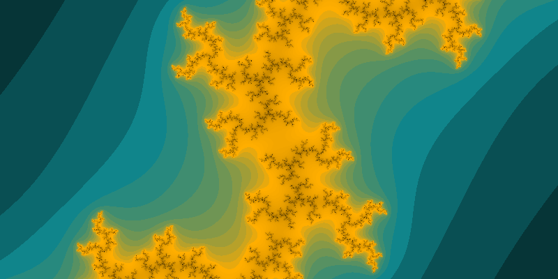
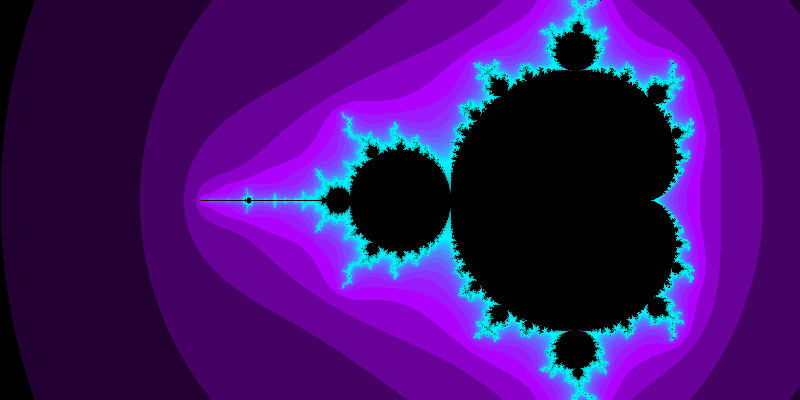
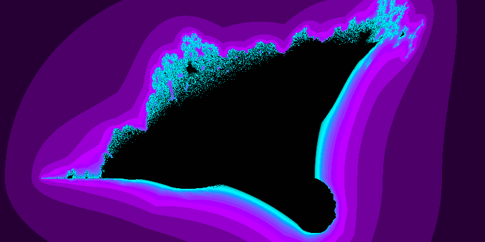

# GO Fractal

A simple golang script to draw julia/mandelbrot fractals.

### Julia Set



### Mandelbrot Set




### Burning Ship



cx=-0.3 &cy=-0.47 z=0.5

## Web server app

Run

```
cd cmd/server
go build
./server
```

Open in browser: http://localhost:10000?cx=-0.3&cy=-0.47&z=0.5


### Url parameters

* t: fractal type. Options: julia, mandelbrot, burningship
* p: predefined colour palette. Options: arcticsun, electro
* w: image width
* h: image height
* z: zoom, default: 1.0
* cx: center by X 
* cy: center by Y
* re:
* im:
* er: escape radius
* mi: max iterations
